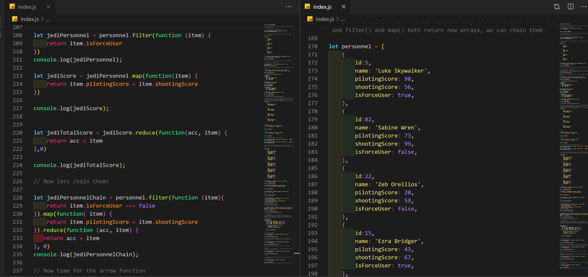

# Map(), Find(), forEach(), Every()

The aim of this project was to revise and learn new methods that are available to the user when extracting and manipulating arrays.

# Technology

* Javascript

 # Author

 Simon Maher
